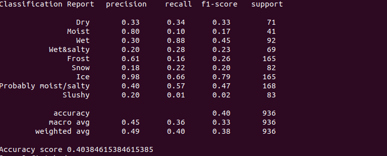

# AM-Traffic-I-Phase-2-Iteration-2-Task2-Tensorflow

Prepare and develop end-to-end pipeline (for a road condition classification light-weight neural network).

As an input this model should take a video sequence from CCTV camera; As an output model should classify road condition (Dry, Moist, Wet, Wet & Salty, Frost, Snow, Ice, Probably moist/salty, Slushy).

-------------------------------------------------------------------------------------------------------------------------------

# Data
The data was collected during task4. As described in task4, the images were downloaded in AWS S3 bucket and the labels are included in the images’s names whose format is as follows:<br/>
 *'camera-id'\_r'roadConditionCategory'\_w'weatherConditionCategory'\_'measuredTime'*<br/>
 eg. "C1255201_r7_w0_2020-01-29_21-00-39"<br/>
 The road conditions to classify are:<br/>
 * Dry (0): road condition is clear.
 * Moist (1): road seems not to be dry nor wet, and no water reflections.
 * Wet (2):  all road is wet and visible water reflections.
 * Wet & Salty (3): road is wet and there are traces of after snowfall.
 * Frost (4): Snow on road and you can find a special texture.
 * Snow (5): all road area or majority of it is covered by snow.
 * Ice (6): Visibile continues lines on snowy road.
 * Probably moist/salty (7): Same as moist condition but with traces after snowfall.
 * Slushy (8): road is covered in mud, like the Ice condition but when it's brown.
 
<p align="center">
  
   
  
</p>

<p align="center">
  
   
  
</p>

<p align="center">
  
   
  
</p>
 
Unfortunately the labels are not accurate and have many mistakes and that’s due to different reasons such as the quality of the image, the distance between camera and weather station, sensors errors… so manually checking the labels was necessary. 
# Training the model (train.py)
The training was made using **1xGPU NVIDIA Tesla K80** (on Microsoft Azure NC6).

Once the data was ready, a model was built with tensorflow. I used the resnet50 architecture pretrained on imagenet dataset. The choice of the architecture was based on the fact that the model must be light weighted in order to be run in realtime on a Jetson Nano device. Therefore, I had to make a compromise between accuracy and lesser number of parameters. Since depth-wise convolutions are known of low accuracy, I didn’t opt for mobilenet. So I found that resnet50 (less layers is not available in Keras) is the best candidate.<br/>  
The data was augmented (horizontal_flip, rotation, width_shift, height_shift) using keras library.<br/>
For the model finetuning grid search was applied to these hyperparameters:
* **learning_rate**: The learning rate of Adam algorithm
* **batch_size**: Training batch size
* **image_size**: Chosen size of image
* **layers_fine_tune**: Layers to be unfrozen and fine tuned

The best validation accuracy I got is **0.8125** with training accuracy of **0.78** (execution **#17** in Valohai). 
This model was obtained with learning rate equal to **0.001**, batch size of **128** sample, image with **(512x512)** size and *1* layer fine tuned.

Plot of train/validation accuracy per epoch.
<p align="center">
  
</p>

Plot of train/validation loss per epoch.
<p align="center">
  
</p>

# Testing the model (predict.py)
To test the performance of the model we run the model on images not included in training and validation datasets.
## Prediction on images
You can make predictions on images following these steps:
1. Download *WeatherRoad_EvaluationDataset.zip* from [here](https://drive.google.com/open?id=1MDuIcb1pNqmTAYhkhY_5IegAgPL0dnkH) and extract it to the root folder. (Use road folder for the testing)
2. Download Model weights from [here](https://drive.google.com/open?id=1LcW1wH_Pq99LD4IPMqow0DjVVFk-lPwn) and put it in the *models* folder in the root folder.
3. From the root folder execute:
   ```sh
   python3 predict_images_tf.py --predictions road --model ./models/RoadCondi.h5 --input ./WeatherRoad_EvaluationDataset/road --output ./output_road --labels ./road_labels.json
   ```
    Where:
     * **'predictions'**: road (conditions to predict).
     * **'model'**: the path of the training model.
     * **'input'**: the path of your input images.
     * **'output'**: the path of the output images.
     * **'labels'**: the path of labels json file.
4. Check annotated images in /output_road folder and network metrics in the terminal window.

### Results
The predictions are displayed on images as follows:

<p align="center">
  
</p>

<p align="center">
  
</p>

Predictions metrics calculated on the test dataset:

<p align="center">
  
</p>

## Prediction on video
You can predict on video using *predict_video_tf.py* script:
```sh
python3 predict_video_tf.py --predictions road --model ./models/tensorflow/RoadCondi.h5 --input ./test_video.mp4 --labels ./road_labels.json --output ./output_road/road_conditions.avi --size 1
```
Where:
* **'predictions'**: road (conditions to predict).
* **'model'**: the path of the training model.
* **'input'**: the path of your input vdeo (you have to mention the input video name).
* **'output'**: the path of the output video (you have to mention the output video name).
* **'labels'**: the path of labels json file.
* **'size'**: size of queue for averaging (128 by default). Set the size to 1 if you  don't want to perform any averaging.
# Conversion to TensorRT
Conversion of the built Keras model to TensorRT model.
## Requirement
* tensorflow-gp~=1.15.0
* Keras~=2.2.5
* argparse~=1.4.0
## Conversion
Use the script *convert_keras_to_trt.py* as follows:
```sh
python3 convert_keras_to_trt.py --trt_path ./models/keras_trt --model ./models/tensorflow/RoadCondi.h5 --output_node dense_1/Softmax
```
Where:
* **trt_path**: path where to save the converted models.
* **model**: path to trained serialized keras model.
* **output_node**:  name of the output node (*dense_1/Softmax* in our case).

After running this script successfully, in trt_path you will have:
*checkpoints, tf_model.meta, frozen_model.pb and tensorrt_model.pb.* 

# Inference on Jetson Nano
After converting the models to TensorRT we can make inferences on Jetson Nano following these instructions:
1. Setup Jetson Nano:
```sh
sudo apt update
sudo apt install python3-pip libhdf5-serial-dev hdf5-tools
pip3 install --extra-index-url https://developer.download.nvidia.com/compute/redist/jp/v43 tensorflow-gpu==1.15.0+nv20.1
pip3 install pillow
```
2. Download zip file that contains TRT weights from [here](https://drive.google.com/open?id=1Ontame0VWgJU-z0oYC1g2JEcahYkJk1W).
3. Unzip the zip file.
4. Choose the appropriate TRT weights that you will use and upload it on Jetson Nano.

   PS:
   * **w_** refers to weather classification.
   * **r_** refers to road classification.
   * **pt_** means that this model was trained using 'Pytorch'.
   * **tf_** means that this model was trained using 'Tensorflow'.
   * **16** and **32** refer to 'Foating Point Precision' type.
5. Choose an image you want to predict and upload it on the same directory as the model and the prediction script **predict_trt.py**.
6. From the folder where files are uploaded execute:
   ```sh
   python3 predict_trt.py --input_node resnet50_input --output_node dense_1/Softmax --path r_tf_32_tensorrt_model.pb --img_path img0.jpg --labels road_labels.json --shape_size 512 --time true
   ```
   
   Where:
     * **'input_node'**: name of the input node.
     * **'output_node'**: name of the output node.
     * **'path'**: path to the trt model.
     * **'img_path'**: path to the image we want to predict.
     * **'labels'**: the path of labels json file.
     * **'shape_size'**: input shape (height).
     * **'shape_size'**: set it to True if you want to compute the execution time and fps.
     
   ## Results
   For model with 'Foating Point Precision' equal to 32 the **average(sec/frame)** is 0.17 and the **fps** is 5.87.
   
   For model with 'Foating Point Precision' equal to 16 the **average(sec/frame)** varies from 0.16 to 0.17 and the **fps** varies from 6.27 to 6.31.
